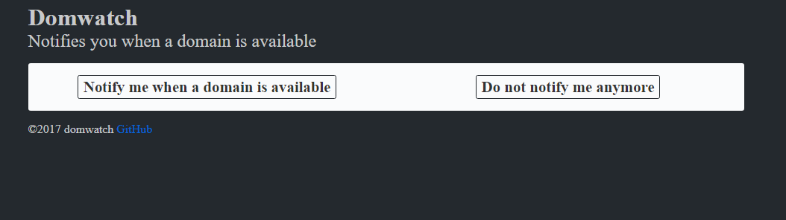
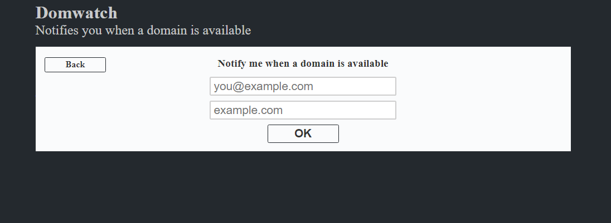

## fcgi
Fcgi module that acts as a daemon, can be used for a website

### Usage 
Compile and configure

### Configuration
Edit `config.json` and place it in the same directory as the executable.

### API
#### Add a watcher
URL: `/api1/watch`    
Request (`Content-Type: application/json`, Method: `POST`):

    {
        "Email": "you@example.com",
        "Domains": ["example1.com", "example2.com"]
    }

Response (`Content-Type: application/json`):
HTTP Status Code: 200

    {}

Any other Code:

    {
        "Error": "error message"
    }

#### Remove a watcher
URL: `/api1/unwatch`    
Request (`Content-Type: application/json`, Method: `POST`):

    {
        "Email": "you@example.com",
        "Domains": ["example1.com", "example2.com"]
    }

Response (`Content-Type: application/json`):
HTTP Status Code: 200

    {}

Any other Code:

    {
        "Error": "error message"
    }

#### Statisitics
URL: `/api1/stats`    
Request (Method: `GET`):

    {}

Response (`Content-Type: application/json`):
HTTP Status Code: 200

    {
        "Domains": 0,
        "Users": 0
    }

Any other Code:

    {
        "Error": "error message"
    }

